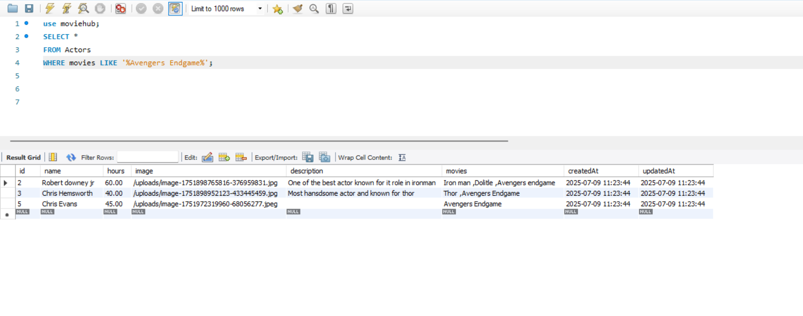
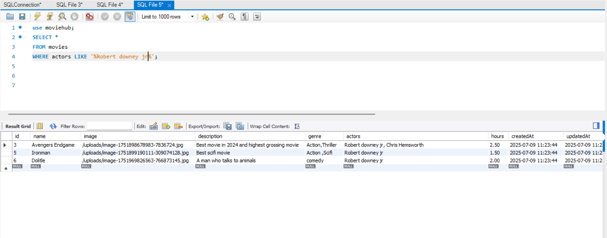

# MovieHub Movie & Actor Management App

A full-stack application for managing movies, actors, and users, built with React (frontend) and Node.js/Express/Sequelize (backend).

---

## Actor Sample Images

Below are actor sample images from the `images` folder:

| a1.png | a2.png |
|--------|--------|
|  |  |

---

## Features
- Movie and actor management (CRUD)
- User authentication (admin & user roles)
- Admin panel for managing movies, actors, and users
- Responsive UI with modern design
- Database seeding for demo data

---

## Security & Access Control

### OTP (One-Time Password)
- The application supports OTP-based email verification for user registration and password reset flows.
- OTPs are generated and sent to the user's email, stored securely in the database with an expiry time.
- Users must enter the correct OTP within the valid time window to verify their email or reset their password.

### Tokenization (JWT)
- The backend uses JSON Web Tokens (JWT) for stateless authentication.
- Upon successful login, a JWT is issued to the user and must be included in the Authorization header for protected API requests.
- Tokens are signed and verified using a secret key, ensuring secure and tamper-proof sessions.

### Authentication
- User credentials (email/username and password) are securely handled and passwords are hashed using bcrypt before storage.
- Login endpoints validate credentials and issue JWTs for session management.
- Only authenticated users can access protected routes and resources.

### Authorization
- Role-based access control is implemented (admin, user).
- Certain routes and actions (like managing movies, actors, or users) are restricted to admin users only.
- Middleware checks the user's role and token validity before granting access to protected endpoints.

---

## Prerequisites
- Node.js (v16+ recommended)
- MySQL database

---

## Getting Started

### 1. Clone the repository
```bash
git clone https://github.com/yourusername/moviehub.git
cd MovieHub
```

### 2. Install dependencies
#### Backend
```bash
cd backend
npm install
```
#### Frontend
```bash
cd ../my-react-app
npm install
```

### 4. Set up the database
- Make sure your MySQL server is running.
- The backend will auto-create tables on first run.

### 5. Seed the database (movies, actors, users)
```bash
cd backend
npm run seed
```
- This will insert demo movies, actors, and users (admin/user) into your database.

### 6. Run the application
#### Development (concurrently runs backend & frontend)
```bash
cd .. # Go to project root
npm run dev
```
Or run separately:
- Backend: `cd backend && npm run dev`
- Frontend: `cd my-react-app && npm run dev`

---

## Demo
[](https://youtu.be/y9u30tU0DLI?si=Gk3qPbEoWMzGTuQA)

---

## Default Users
- **Admin:**
  - Email: `harsha@gmail.com`
  - (Username,Password): (admin, 123456)
- **User:**
  - Email: `harsha1423@gmail.com`
  - (Username,Password): (user, 123456)

You can change these in `backend/seed.js` before seeding.

---

## Folder Structure
```
MovieHub/
  backend/         # Express/Sequelize API
  my-react-app/    # React frontend
```

---

## License
MIT 
